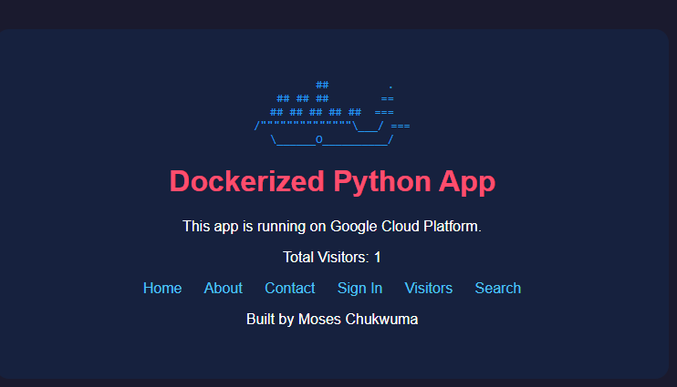

# 🐍 Dockerized Flask Python App


## Overview

A Dockerized Flask web application deployed on a Google Cloud Virtual Machine.

---

## Features

- Visitor Counter
- Search Visitors
- Docker Ready
- SQLite Database
- Responsive Design
- Google Cloud Deployment
- ngrok Public Access

---

## Home Page



---

## Technologies

- Python
- Flask
- SQLite
- Docker
- Git
- GitHub
- Google Cloud Platform
- Linux (Debian)

---

## Installation

```bash
git clone https://github.com/Chuksholymoses/my-python-app.git

cd my-python-app

pip install -r requirements.txt

python3 app.py
```

---

## Author

**Moses Chukwuma**

Cloud & DevOps Engineer

Python Developer

Google Cloud Enthusiast
